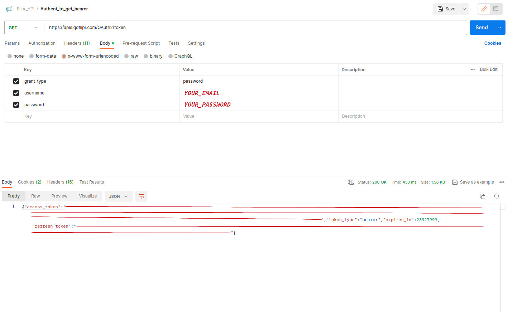
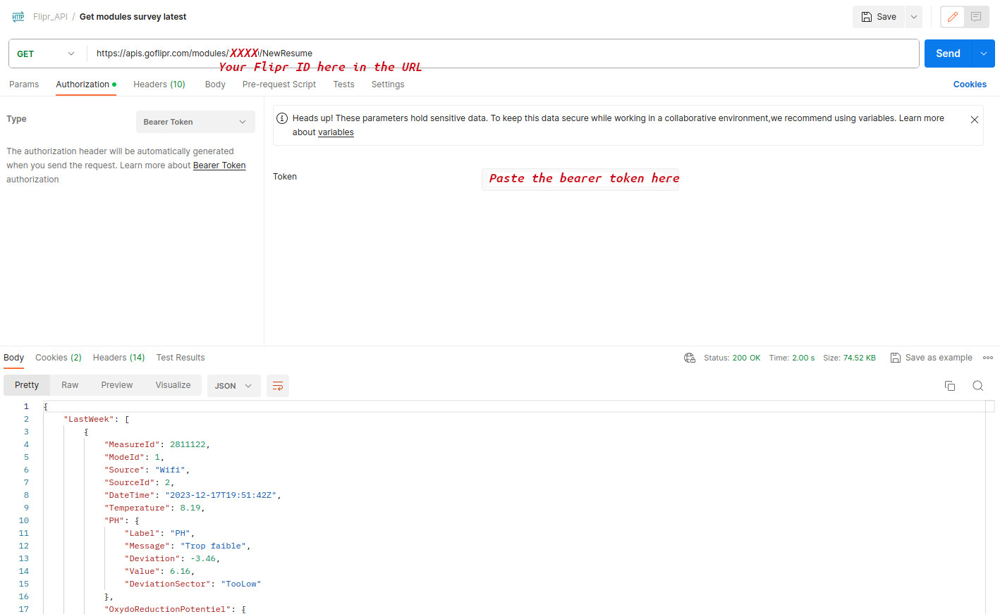

Testing the goFlipr REST API with postman
=========================================

In case of uncertain behaviour of the pyton library, you can easily test directly the REST API with `Postman https://www.postman.com/downloads/`.

Here are some screenshots of how to do it : 

1/ Create an authentification request : 
With url : https://apis.goflipr.com/OAuth2/token
Set the grant_type parameter to password
Set the username parameter to your email adress of the flipr app
Set the password parameter to your password value

Retrieve the bearer token from the "access_token" value of the result.

2/ Create a get resume request : 
With url : https://apis.goflipr.com/modules/XXXXX/NewResume
Replace XXXXX with your flipr ID
Set the bearer token got from the previous response

You should have a result with the data like : 

